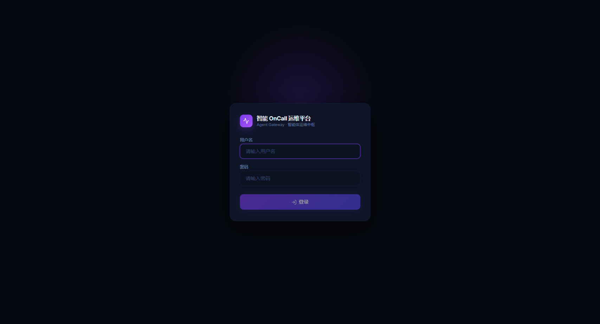
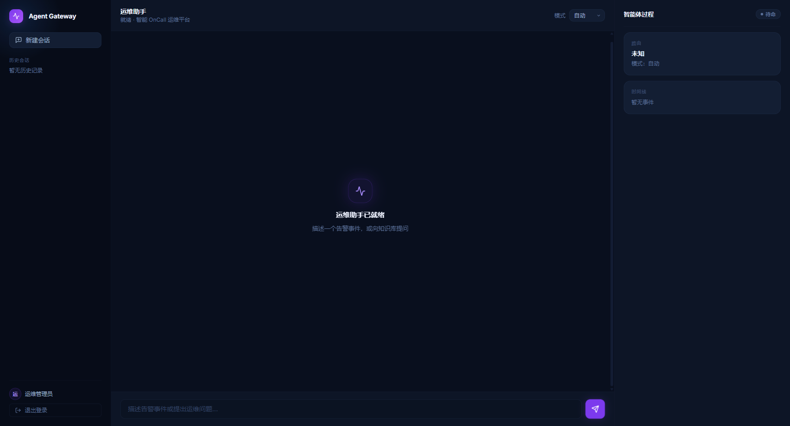

# 智能 OnCall 运维平台 · Agent Gateway

> 面向运维值班（OnCall）场景的智能体平台。统一对话入口、多智能体 Harness 编排、RAG 知识库检索、服务基线与长期经验记忆，帮助值班工程师更快地完成告警诊断与故障定位。

[](https://www.python.org/)
[](https://fastapi.tiangolo.com/)
[](https://react.dev/)
[](https://milvus.io/)
[](#许可证)

---

## 目录

- [简介](#简介)
- [界面预览](#界面预览)
- [核心能力](#核心能力)
- [系统架构](#系统架构)
- [技术栈](#技术栈)
- [快速开始](#快速开始)
- [常用命令](#常用命令)
- [API 概览](#api-概览)
- [项目结构](#项目结构)
- [配置项](#配置项)
- [安全与提交规则](#安全与提交规则)
- [故障排查](#故障排查)
- [许可证](#许可证)

---

## 简介

本项目是一个「OnCall 值班智能体」后端 + Web 控制台：

- 输入一条告警事件或运维问题，平台自动完成 **路由 → 规划 → 工具调用 → 证据自检 → 诊断结论** 的闭环；
- 通过 SSE 流式实时展示智能体的思考过程、工具调用和阶段性结论；
- 内置 RAG 知识库与长期记忆，让历史经验、服务基线和用户偏好可被持续沉淀和复用。

后端基于 FastAPI，Agent 编排使用自研 Harness 主循环；前端为 React 18 + Vite 单页应用。

## 界面预览

| 登录页 | 运维助手工作台 |
| --- | --- |
|  |  |

> 截图仅展示界面，不含任何真实数据或凭证。

## 核心能力

- **统一助手入口**：`POST /api/assistant` 以 SSE 流式返回路由、工具调用、诊断过程和最终回答。
- **多智能体 Harness**：规划、上下文准备、专家路由、子任务执行、证据自检与降级收尾。
- **专家能力**：知识库问答、指标/告警分析、日志分析、变更排查与综合诊断。
- **RAG 知识库**：支持文档上传、受信目录索引、Milvus 向量检索与稠密/混合检索配置。
- **长期记忆**：沉淀诊断经验、服务知识、指标基线与用户偏好，并可重建向量索引。
- **Web 控制台**：登录、会话历史、实时过程面板、服务基线管理。
- **MCP 集成**：可接入日志查询（CLS）与监控数据（Monitor / Prometheus）服务。

## 系统架构

```text
┌────────────┐    SSE     ┌─────────────────────────────────────────────┐
│  React 前端 │ ◀────────▶ │                FastAPI 后端                   │
│  (Vite)    │  /api/*    │  ┌────────────┐  ┌────────────────────────┐  │
└────────────┘            │  │ Router 路由 │─▶│ Harness 主循环 / 专家    │  │
                          │  └────────────┘  └───────────┬────────────┘  │
                          │   会话/记忆/知识库 services      │ 工具调用       │
                          └───────────────────────────────┼───────────────┘
                                  │                │       │
                            ┌─────▼────┐   ┌───────▼───┐  ┌▼──────────────┐
                            │ SQLite   │   │  Milvus   │  │ MCP: CLS /     │
                            │ 会话/记忆 │   │ 向量索引   │  │ Monitor(Prom)  │
                            └──────────┘   └───────────┘  └────────────────┘
```

## 技术栈

| 层 | 选型 |
| --- | --- |
| 后端 | FastAPI、Pydantic Settings、SSE (sse-starlette)、Loguru |
| Agent | 自研 Harness、专家路由、本地工具调用、MCP 接入 |
| 模型 | OpenAI-compatible LLM 接口，兼容 DashScope / Qwen |
| 向量库 | Milvus（pymilvus） |
| 监控 | Prometheus（监控 MCP 的 PromQL 路径） |
| 前端 | React 18、Vite、TypeScript、Vitest |
| 存储 | SQLite（本地会话与记忆库）、Milvus（向量索引） |

## 快速开始

### 0. 前置依赖

- Python **3.11 – 3.13**
- Node.js 18+ 与 npm
- Docker（用于 Milvus，可选 Prometheus）
- 可选：[`uv`](https://github.com/astral-sh/uv) 包管理器、`make`

### 1. 克隆项目

```bash
git clone https://github.com/wangjialin2004/Oncall-agent.git
cd Oncall-agent
```

### 2. 安装后端依赖

```bash
python -m venv .venv

# Windows PowerShell
.venv\Scripts\Activate.ps1
# Linux / macOS
source .venv/bin/activate

pip install -e ".[dev]"
```

如果安装了 `uv`：

```bash
uv venv
uv pip install -e ".[dev]"
```

### 3. 配置本地环境变量

真实密钥只写入本地 `.env`，**切勿提交 `.env`**。

```bash
cp .env.example .env          # Windows: Copy-Item .env.example .env
```

`.env.example` 是纯注释模板。在 `.env` 中取消需要的行注释并填入真实值，例如：

```dotenv
LLM_PROVIDER=openai
LLM_BASE_URL=https://your-openai-compatible-endpoint/v1
LLM_API_KEY=replace-with-local-llm-api-key
LLM_MODEL=your-model

DASHSCOPE_API_KEY=replace-with-local-dashscope-api-key
AUTH_TOKEN_SECRET=replace-with-a-local-random-secret
```

> `.env`、`.env.local`、`.env.*` 已被 `.gitignore` 忽略；`.env.example` 仅提交占位示例；日志、运行输出、Playwright 快照与本地数据库目录均不会提交。

### 4. 启动 Milvus

```bash
docker compose -f vector-database.yml up -d
```

### 5. （可选）启动 Prometheus

监控专家走 PromQL 路径时使用。需后端在 9900 端口暴露 `/metrics`。

```bash
docker compose -f monitoring.yml up -d     # 或 make start-prometheus
```

- Prometheus: http://localhost:9090

### 6. 启动后端

```bash
python -m uvicorn app.main:app --host 0.0.0.0 --port 9900 --reload
```

- API: http://localhost:9900
- API 文档: http://localhost:9900/docs
- 健康检查: http://localhost:9900/health

### 7. 启动前端开发服务

```bash
cd frontend
npm install
npm run dev
```

前端默认 http://localhost:5173，并通过 Vite proxy 调用 `http://localhost:9900/api/*`。

### 8. （可选）启动 MCP 服务

```bash
python mcp_servers/cls_server.py        # 日志查询，默认 http://localhost:8003/mcp
python mcp_servers/monitor_server.py    # 监控数据，默认 http://localhost:8004/mcp
```

## 常用命令

### Windows 一键脚本

```powershell
.\start-windows.bat     # 启动
.\stop-windows.bat      # 停止
```

> 脚本会在本地生成 `.log` 和 `.pid` 文件，这些文件已被 `.gitignore` 忽略。

### Make 管理命令（Linux/macOS 或已安装 make 的环境）

```bash
make up                 # 启动 Milvus 等依赖
make start              # 启动后端 + MCP
make stop               # 停止
make restart            # 重启
make start-prometheus   # 启动 Prometheus
make status-mcp         # 查看 MCP 状态
make test               # 运行后端测试
make lint               # 代码检查
make format             # 代码格式化
make check-all          # 运行全部检查（lint + type-check + test）
```

完整目标见 `make help`。

### 测试与构建

```bash
python -m pytest        # 后端测试

cd frontend
npm test                # 前端测试（Vitest）
npm run build           # 前端构建
```

## API 概览

所有 `/api/*` 接口（除登录外）需携带 `Authorization: Bearer <token>`。

### 认证

| 方法 | 路径 | 说明 |
| --- | --- | --- |
| POST | `/api/auth/login` | 登录并返回 Bearer token |
| POST | `/api/auth/logout` | 退出登录 |

### 统一助手

| 方法 | 路径 | 说明 |
| --- | --- | --- |
| POST | `/api/assistant` | SSE 流式助手入口，自动完成路由、执行与回答 |

请求示例：

```bash
curl -N -X POST "http://localhost:9900/api/assistant" \
  -H "Content-Type: application/json" \
  -H "Authorization: Bearer <token>" \
  -d '{"Id":"session-123","Question":"帮我诊断 checkout-api 的 CPU 告警"}'
```

SSE `message` 数据包含不同类型事件：`route_selected`、`agent_event`、`tool_event`、`decision_event`、`content`、`complete`、`error`。

### 会话历史

| 方法 | 路径 | 说明 |
| --- | --- | --- |
| GET | `/api/conversations` | 查询当前用户的会话列表 |
| GET | `/api/conversations/{session_id}` | 恢复指定会话 |
| DELETE | `/api/conversations/{session_id}` | 删除指定会话 |

### 文件与知识库

| 方法 | 路径 | 说明 |
| --- | --- | --- |
| POST | `/api/upload` | 上传文件并创建向量索引 |
| POST | `/api/index_directory` | 索引受信目录内的文件 |

### 长期记忆与服务知识

| 方法 | 路径 | 说明 |
| --- | --- | --- |
| POST | `/api/memory/feedback` | 从用户反馈沉淀经验 |
| POST | `/api/memory/experiences` | 手动创建经验 |
| GET | `/api/memory/experiences` | 查询经验列表 |
| GET | `/api/memory/experiences/{experience_id}` | 查询单条经验 |
| PATCH | `/api/memory/experiences/{experience_id}` | 更新经验状态或置信度 |
| POST | `/api/memory/experiences/rebuild-index` | 重建经验向量索引 |
| GET | `/api/memory/services` | 查询服务知识 |
| GET | `/api/memory/services/{service_name}` | 查询单个服务知识 |
| PUT | `/api/memory/services/{service_name}` | 写入服务知识 |
| PUT | `/api/memory/services/{service_name}/baselines` | 写入服务指标基线 |
| DELETE | `/api/memory/services/{service_name}/baselines/{metric_name}` | 删除指标基线 |
| POST | `/api/memory/services/import-seed` | 导入服务知识种子数据 |
| GET | `/api/memory/preferences` | 查询用户偏好 |
| PUT | `/api/memory/preferences` | 更新用户偏好 |

## 项目结构

```text
.
├── app/
│   ├── api/                 # FastAPI 路由（assistant / auth / conversations / file / memory / health）
│   ├── agent/               # Agent 事件、专家、Harness 编排
│   ├── core/                # LLM、Milvus、工具调用等运行时
│   ├── models/              # Pydantic 请求/响应/记忆模型
│   ├── services/            # 会话、记忆、知识库、路由、向量等服务
│   ├── tools/               # Agent 可调用工具
│   ├── utils/               # 日志、文本、时间、序列化工具
│   ├── config.py            # Pydantic Settings 配置入口
│   └── main.py              # FastAPI 应用入口
├── frontend/                # React 18 + Vite 前端
├── mcp_servers/             # CLS / Monitor MCP 服务
├── aiops-docs/              # 示例知识库文档
├── deploy/prometheus/       # Prometheus 配置
├── scripts/                 # 调试、评测与索引脚本
├── tests/                   # 后端测试
├── docs/ · plan/            # 设计、评审与实施计划文档
├── .env.example             # 注释模板，不含真实密钥
├── vector-database.yml      # Milvus docker compose
├── monitoring.yml           # Prometheus docker compose
├── Makefile                 # 管理命令
└── pyproject.toml
```

## 配置项

| 变量 | 用途 |
| --- | --- |
| `LLM_PROVIDER` | LLM 提供方，支持 `openai` / `azure` / `custom` |
| `LLM_BASE_URL` | OpenAI-compatible API 地址 |
| `LLM_API_KEY` | LLM API Key，只写入 `.env` |
| `LLM_MODEL` | 对话与诊断模型 |
| `DASHSCOPE_API_KEY` | DashScope API Key，用于兼容或 embedding |
| `DASHSCOPE_EMBEDDING_MODEL` | 向量模型 |
| `MILVUS_HOST` / `MILVUS_PORT` | Milvus 地址（默认 `localhost:19530`） |
| `HARNESS_ENABLED` | 是否启用统一 Harness 主循环 |
| `HARNESS_MCP_ENABLED` | 是否允许 Harness 调用 MCP 工具 |
| `MCP_CLS_URL` / `MCP_MONITOR_URL` | CLS / Monitor MCP 地址 |
| `PROMETHEUS_BASE_URL` | Prometheus 地址 |
| `AUTH_TOKEN_SECRET` | 本地 token 签名密钥，**生产环境必须覆盖** |

完整示例见 [`.env.example`](.env.example)。

## 安全与提交规则

- **不要提交** `.env`、`.env.local` 或任何真实密钥。
- **不要提交** `logs/`、`*.log`、`*.pid`、`output/`、`.playwright-*`、本地数据库（`*.db` / `volumes/`）。
- `.env.example` 保持全注释，仅作为复制到 `.env` 后手动启用的模板。
- 如果真实 key 曾进入提交历史，应立即在服务商后台吊销并重新生成。
- 默认值 `MINIO_ACCESS_KEY: minioadmin` 仅用于本地 Milvus，**生产部署务必修改**。

## 故障排查

**API Key 未配置**

```bash
# Linux/macOS
grep -E "^(LLM_API_KEY|DASHSCOPE_API_KEY)=" .env
# Windows PowerShell
Select-String -Path .env -Pattern "^(LLM_API_KEY|DASHSCOPE_API_KEY)="
```

**Milvus 连接失败**

```bash
docker ps
docker compose -f vector-database.yml restart
```

**端口被占用（Windows）**

```powershell
netstat -ano | findstr :9900
taskkill /F /PID <PID>
```

**查看日志**

```bash
# Linux/macOS
tail -f logs/app_$(date +%Y-%m-%d).log
# Windows PowerShell
Get-ChildItem logs\*.log | Sort-Object LastWriteTime -Descending | Select-Object -First 1 | Get-Content -Tail 80
```

## 许可证

本项目采用 [MIT License](https://opensource.org/licenses/MIT)。如需在仓库内附带许可证全文，请在根目录添加 `LICENSE` 文件。
